# MongoDB SI Architect Certification

By Sneha Das Gupta - Senior Solution Architect @MongoDB
Ramakrishna Kappagantula @MongoDB

## Will cover

- Relational Migration tool.
- Excel tool -> modernization score card.
- High level portfolio analysis.
- submission guidelines, timelines.

* Atlas overview and recap
* Horizontal use cases
* Vertical use cases
* MongoDB: What's new
* Modernization Scorecard
* SI Architect Submission Process.

## Atlas overview and recap:

- Can be deployed on premise or cloud.
- 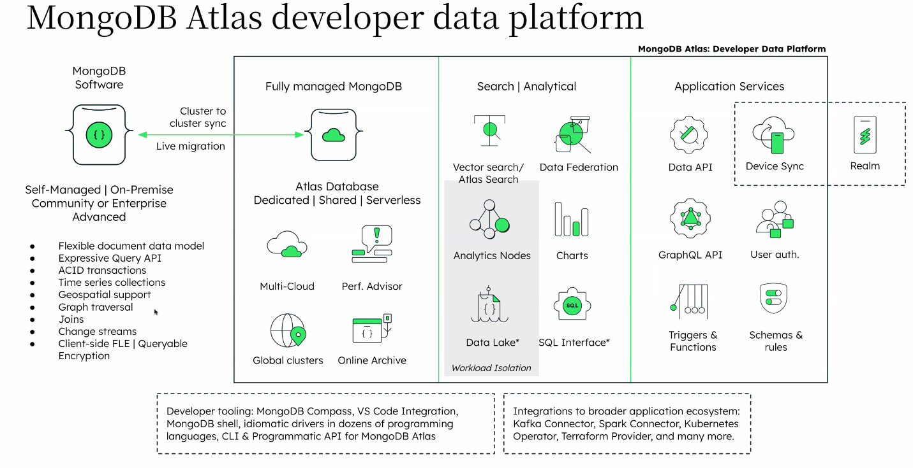
- Flexible document data model
- Expressive Query API
- ACID Transaction
- Time series collection
- Geo Spactial support
- Graph Traversal (like Neo4j)
- Joins
- Change Streams
- Client-side FLE | Queryable Encryption

## Horizontal Use Cases

- 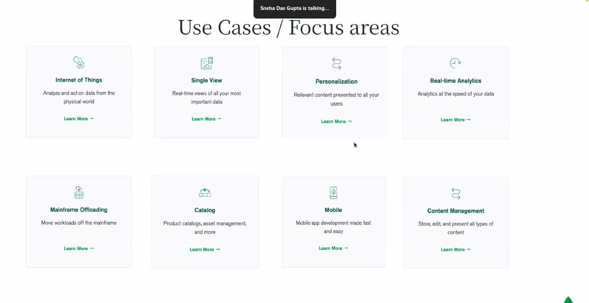
- Use case: [Internet of things](https://mongodb.com/solutions/use-cases/internet-of-things)

### Use Case: Single View

- 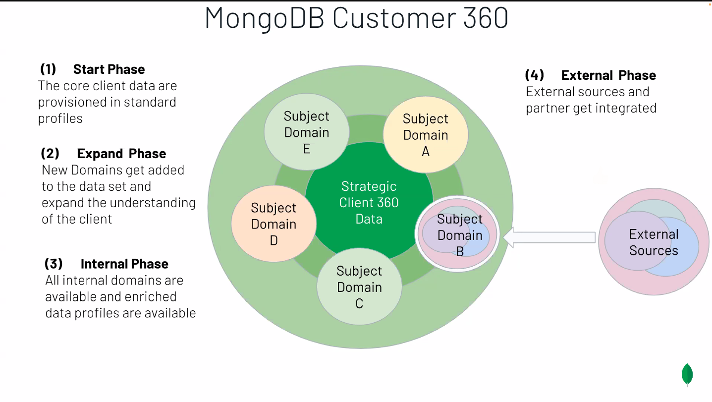
  - Start Phase: The core client data are provisioned in standard profiles
  - Expand phase: New Domains get added to the data set and expand the understanding of the client.
  - Interval Phase: All Internal domains are available and enriched data profiles are available.
  - External Phase: External Sources and partner get integrated
- 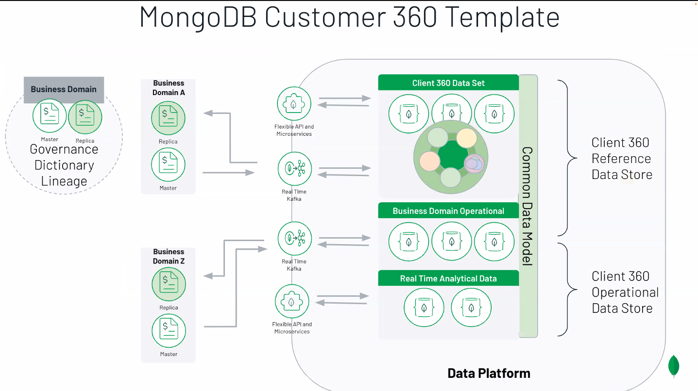

### Use Case: Mainframe Offloading

- Their are 5 phases in a Mainframe Project
- 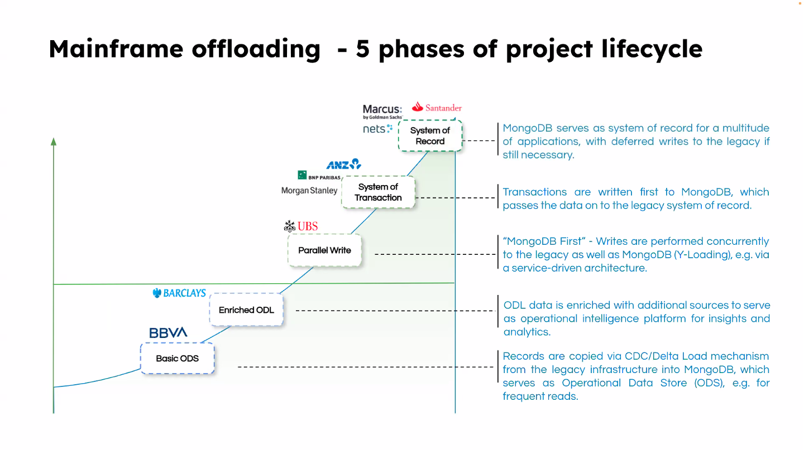
  - Basic ODS
  - Enriched ODL
  - Parallel Write
  - System of Transaction
  - System of Record
- Example:
  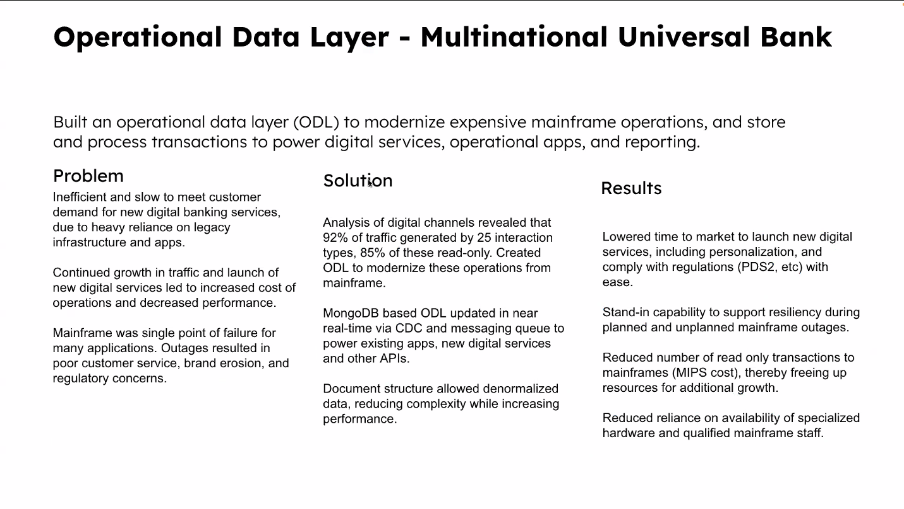
  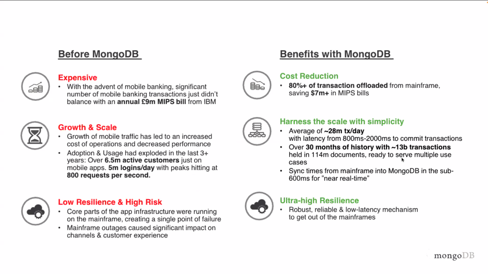

## Vertical Use Case:

### Done this before for

- 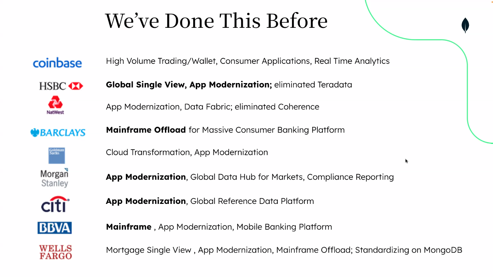
- 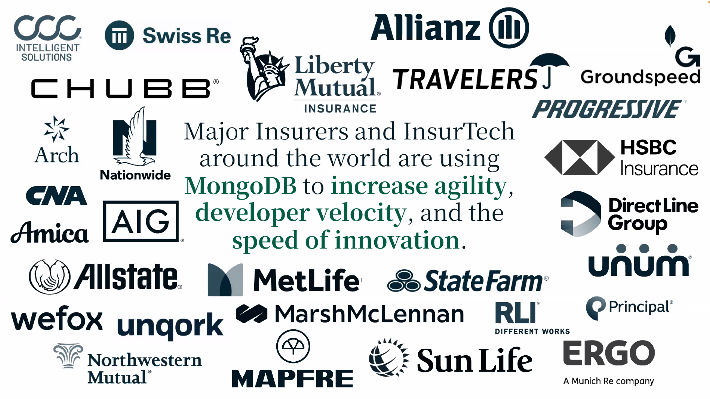
- 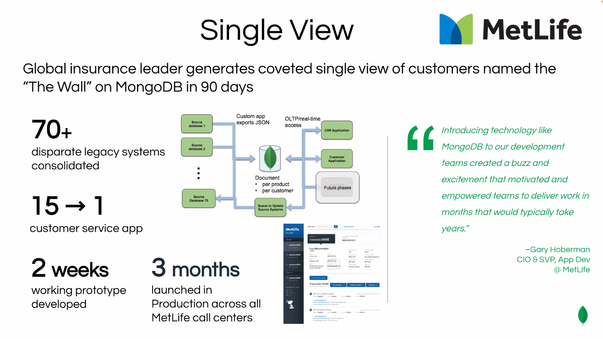

## GenAI Architecture with MongoDB

- RAG Architecture: 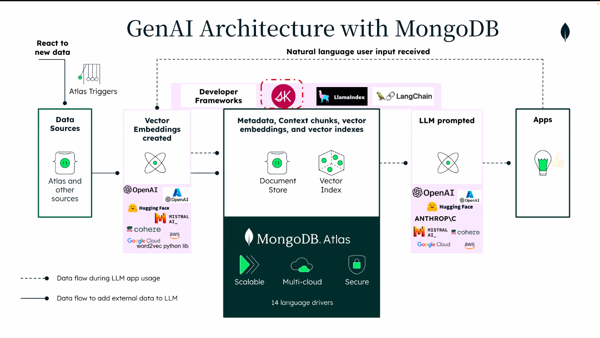
- 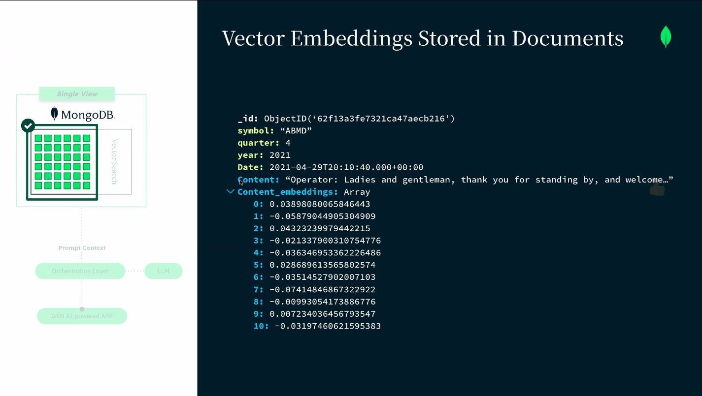
- 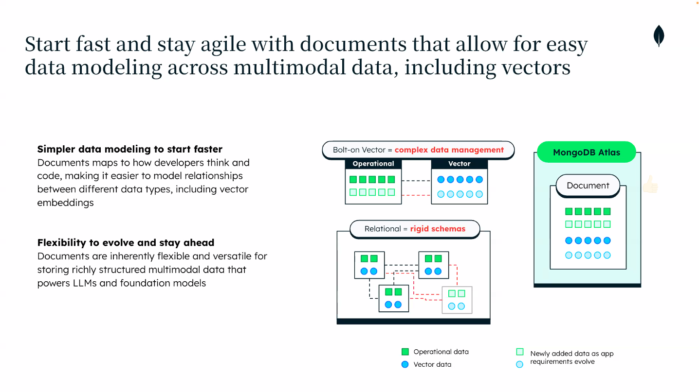
  - Bolt-on Vector is comples data management

### Atlas Vector Search

- 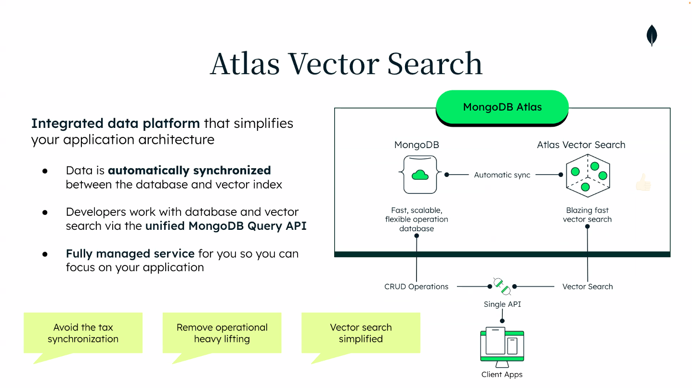
- Separated dedicated nodes for vector search or atlas search
- CRUD operations in separate nodes.

### Compass:

## ToDo:

- 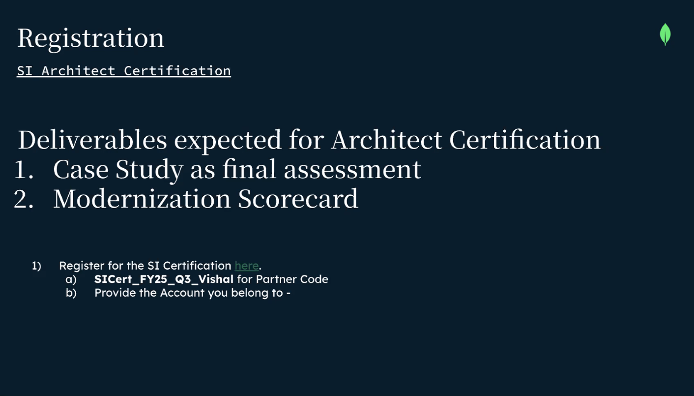
- https://decisiontree-wdqzf.mongodbstitch.com/
- 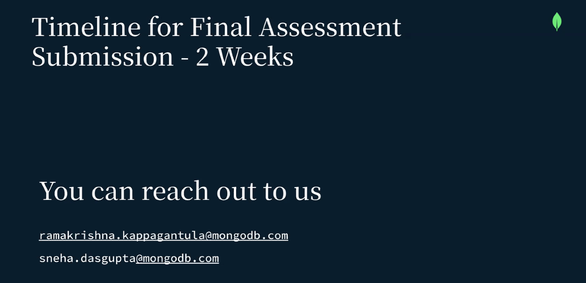
- 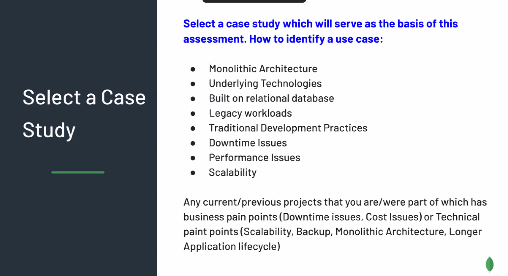
- 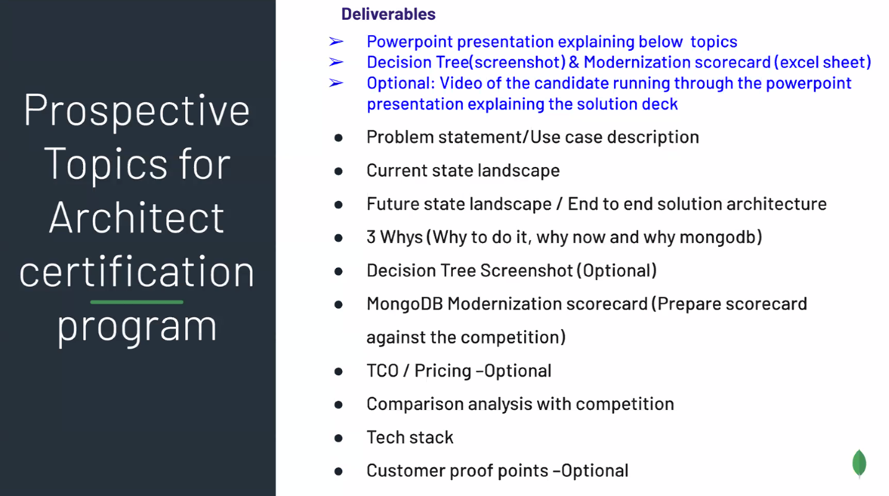
