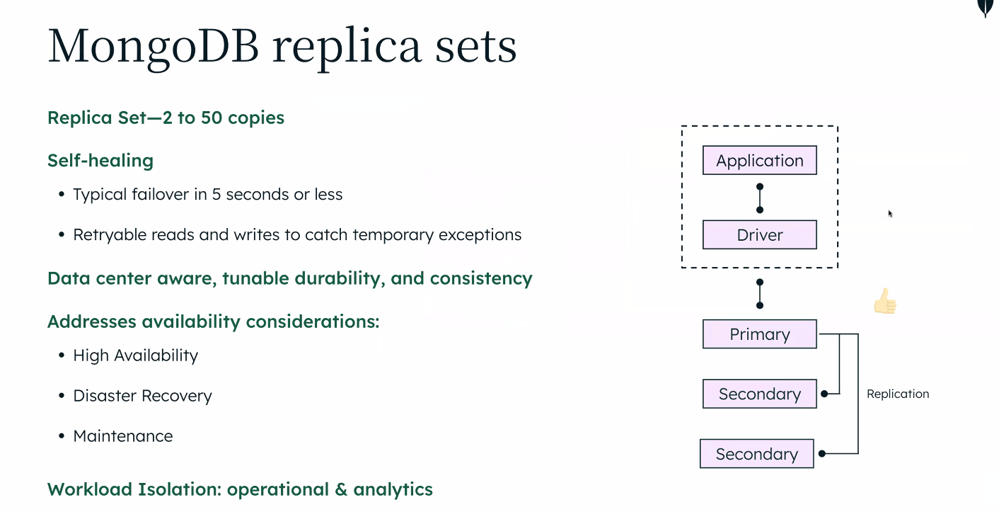

# mongodb:

nosql db ranks 4
400million downloads
devloper data platform atlas platform
1.5 million students

## general purpose DB:

- Native data structures and owned drivers
- expressive query languge and secondary indexes
- acid transactions
- enterprise security & mangament
- laptop you data center multi cloud
- scale and distribution

## store objects directly

- direct map to mongodb documents in db
- customer -> customer, opportunity -> opportunity
- closely alligned to application object model
- easiar to access data and manipulate in more intutive mannar.

## Some Terminology

- Database: will contain collections
- Relationships: concept of nested sub documents or arrays which can store data inside main document. Avoid complex joins because of this.
- Index: to improve query performance.
- row: is document in mongodb
- columns: field in mongodb
- join: embedding, linking, $lookup,
- view: read-only view on-demand materialized view, incase of read heavy workload
- Multi-record acid transaction: Multi-record acid transaction

## RDBMS


- ETL: Extract, transform, load.
  [aws etl](https://aws.amazon.com/what-is/etl/)
- [si-associate-certification](https://www.mongodb.com/company/partners/si-certification-program/si-associate-certification)
- DIRT: data & innovation recurring tax.

## MongoDB

- Flexible document model.
- JSON like model.
- Document model:
  - Key value
  - Graphs
  - Relationships
  - geospatial
  - time series
  - Objects
- Unified interface:
  - Transactional
  - search
  - mobile
  - real-time analytics
  - data lake
- Security
- multi-cloud
- Distirbuted architecture
- 
- 
- 
- 
- 
- [data modeling](https://www.mongodb.com/basics/data-modeling)
- 
- 
- 

## Data Governance

### JSON Schema:

- Enforces Stict schema structure over a complete collection for data governance & quality.
  - Builds on document validation introduced by restricting new content that can be added to a document.
  - Enforces presence

### Tunable

Enforce document structure, log warnings, or allow complete schema flexibility

### Queryable

Identify all existing documents that do not comply

- 

## Fully indexable:


### Create index:

```mongodb
db.collection.createINdex({"field":1, "unique": true})
```

### Aggregration Framework:


```mongodb
db.orders.aggregate([
	{$match: {status: "A"}},  // match stage
		{$group: {_id: "$cust_id", total: {$sum: "$amount"}}} // group stage
])
```

## Replica set:

- 
- Vertical scalability.
- Replica set 2 to 50 copies
- Self Healing:

- Data center aware, tunable durabilty, and consistance
- Addresses availability considerations:
- Workload isolation: operational analytics

### Workload Isolation:

- Transactional applications -> db (primary, secondary, secondary{analytics node}) -> analytics consumers
- Avoid resource contention.

### Sharding Architecture:

- 
- indivisually a replica
- partition based on range
- Horizonatal scalability

## Compliance:

- ISO
- AICPA SOC
- Privacy Shield
- HIPAA
- PCI
- GDPR

## Atlas demo:

- [atlas](https://www.mongodb.com/atlas)
- Cluster creation: Serverless, Dedicated, Shared
- 

## steps you need to perform

1. click on [certification link](https://www.mongodb.com/company/partners/si-certification-program/si-associate-certification)
   Partner Code - `SICert_FY25_Q3_Vishal`
2. [Quiz Link](https://learn.mongodb.com/learn/enroll/5d40c1f8-5a17-445e-993c-8beec174cd99)

provide your infosys email id and click on “Next” which should take you through your SSO or directly into our quiz page..

## References: 
Useful links : Associate

MongoDB Architecture and datapath 

https://www.mongodb.com/developer/products/mongodb/global-read-write-concerns/
https://www.mongodb.com/blog/post/demystifying-sharding-mongodb
https://www.mongodb.com/features/database-sharding-explained
https://www.mongodb.com/blog/post/scale-out-without-fear-friction-live-resharding-mongodb
https://www.mongodb.com/docs/manual/reference/command/analyzeShardKey/

Atlas Backup

https://www.mongodb.com/blog/post/data-resilience-with-mongodb-atlas

Analyzing queries

https://youtu.be/5ZDaK6BUxcE?feature=shared
https://www.youtube.com/watch?v=UMzt4PbHtm8

Aggregations / replacement for Stored Procedures

https://www.practical-mongodb-aggregations.com/
https://www.mongodb.com/collateral/technical-guide-migrating-stored-procedures-to-mongodb
https://www.mongodb.com/developer/videos/migrating-stored-procedures-to-mongodb/

Security / Encryption

https://www.mongodb.com/products/capabilities/security/encryption
https://www.mongodb.com/docs/v7.0/core/querya
https://www.mongodb.com/docs/v7.0/core/queryable-encryption/


Atlas Data Lake/ Federations 

https://www.mongodb.com/blog/post/announcing-atlas-data-federation-data-lake

Atlas Charts

https://www.mongodb.com/docs/charts/welcome-experience/

App Services

https://www.mongodb.com/collateral/building-event-driven-applications-with-mongodb
https://www.mongodb.com/developer/languages/javascript/nodejs-change-streams-triggers/
https://www.mongodb.com/developer/products/mongodb/leverage-event-driven-architecture-mongodb-databricks/

Data Modelling 

https://www.mongodb.com/basics/data-modeling
https://www.mongodb.com/developer/products/mongodb/mongodb-schema-design-best-practices/
https://learn.mongodb.com/courses/schema-design-patterns

Indexing 

https://www.mongodb.com/docs/manual/applications/indexes/

Time Series

https://www.mongodb.com/blog/post/three-reasons-two-ways-use-improved-time-series-collections
https://www.mon

